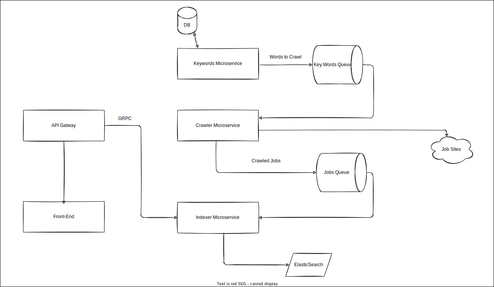

# Job Crawler

Job crawler and indexer site which aggregates jobs from different sources and lists them for you in one place, based on microservice architecture and Golang.

The project is split into five components:

1. [API Gateway](./api) A Golang front facing server which handles all incoming traffic.

2. [Keywords](./keywords/) A Golang service which handles providing keywords to be crawled.

3. [Crawler](./crawler/) A Golang service which handles receiving keywords and crawling different job sites for jobs then pushing them to be indexed.

4. [Indexer](./indexer/) A Golang service which handles indexing and searching jobs.

5. [Frontend](./frontend/) A Next.js frontend app that provides interface for searching and listing jobs.

## Getting Started

### Using docker-compose

- You need to have [docker](https://www.docker.com/) and [docker-compose](https://docs.docker.com/compose/) installed
  
- If you want to add specific keywords to be crawled add them in this [csv file](./keywords/data/seedKeyWords.csv)
  
- Run

  ```shell
   docker-compose up
   ```

- when the compose command is done open your browser at <http://localhost:8081>

## Architecture Diagram



## To Do

- [ ] Add frontend filter location, job source, ... etc
- [ ] Use user search as source for new keywords
- [ ] Add unit test
- [ ] Add CI/CD pipeline  

### Want to help

1. Fork the project
2. Create your feature branch

    ```sh
    git checkout -b feature/add-magic
    ```

3. Commit your changes

    ```sh
    git commit -m 'Add some magic'
    ```

4. Push to the branch

    ```sh
    git push origin feature/add-magic
    ```

5. Open a pull request

## Authors

[Khaled-Abdelal](https://www.linkedin.com/in/khaled-abdelal-a73b3a125/)
